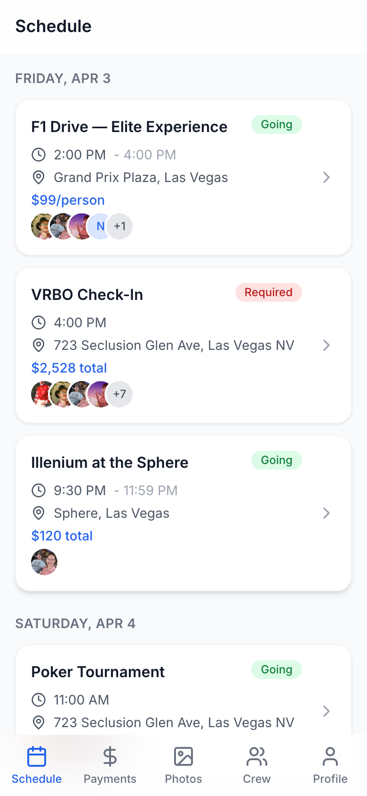
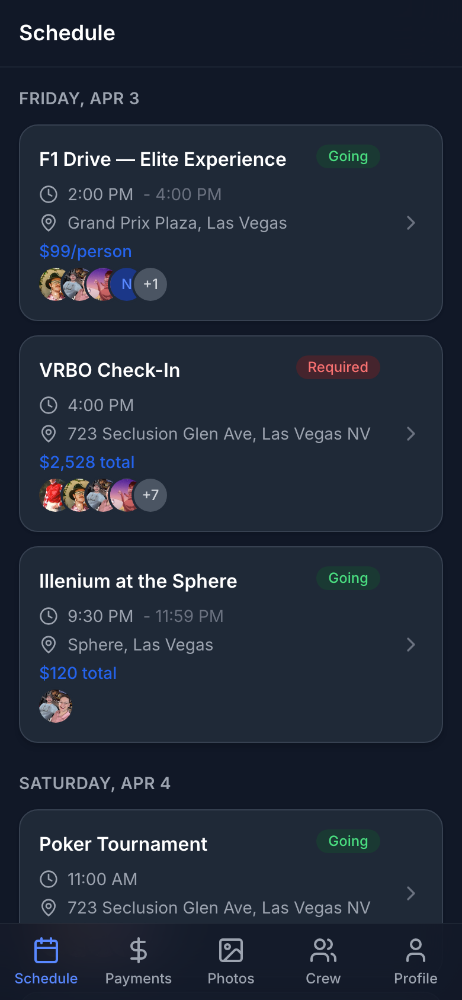
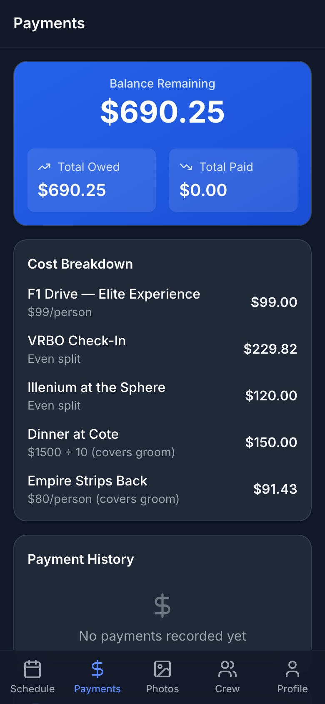
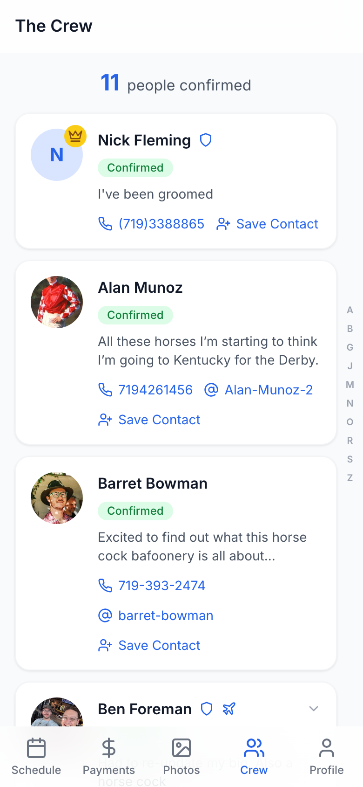

<p align="center">
  
</p>

<h1 align="center">BachBoys</h1>

<p align="center">
  <strong>A mobile-first PWA for coordinating bachelor parties</strong>
  <br />
  Built with React, Express, PostgreSQL & Docker
</p>

<p align="center">
  
  
  
  
  
  
  
</p>

---

## Screenshots

<p align="center">
  
  &nbsp;&nbsp;
  
  &nbsp;&nbsp;
  
  &nbsp;&nbsp;
  
</p>

---

## Features

| Feature | Description |
|---------|-------------|
| **Schedule** | Timeline view with event cards, RSVP for optional activities, venue links & Google Maps |
| **Cost Splitting** | Fixed per-person rates or even group splits, automatic recalculation as guests join |
| **Payments** | Per-person balance tracking, payment reporting, admin confirmation |
| **The Crew** | Attendee profiles with contact info, vCard export, trip status, alphabet quick-nav |
| **Push Notifications** | Web push for schedule changes, payment reminders, and event alerts |
| **Admin Panel** | Full CRUD for events/users, cost split editor, payment management, notification broadcasting |
| **Dark Mode** | System-aware theme with manual light/dark/system toggle |
| **PWA** | Installable on iOS & Android, offline support via service worker |

---

## Tech Stack

```
Frontend                    Backend                     Infrastructure
─────────                   ─────────                   ──────────────
React 18 + TypeScript       Express + TypeScript        Docker Compose
Vite                        PostgreSQL 16               Nginx (reverse proxy)
Tailwind CSS                JWT auth (access/refresh)   Web Push (VAPID)
React Query + Zustand       RESTful API                 Self-hosted
```

---

## Quick Start

### Prerequisites

- Docker & Docker Compose
- Node.js 20+ (for local dev without Docker)

### 1. Clone & Configure

```bash
git clone https://github.com/ben4mn/bachboys.git
cd bachboys
cp .env.example .env
# Edit .env with your secrets (JWT keys, VAPID keys, etc.)
```

### 2. Start

```bash
docker compose up -d
```

| Service | URL |
|---------|-----|
| Frontend | `http://localhost:5173` |
| Backend API | `http://localhost:3031` |

### 3. Seed (optional)

```bash
docker compose exec backend npm run seed
```

Creates test accounts and sample event data.

---

## Local Development

```bash
# Backend
cd backend && npm install && npm run dev

# Frontend (separate terminal)
cd frontend && npm install && npm run dev
```

---

## Project Structure

```
bachboys/
├── backend/
│   └── src/
│       ├── routes/           # Auth, events, payments, users, admin
│       ├── services/         # Push notifications
│       ├── db/               # Pool, migrations, seed
│       ├── middleware/        # JWT auth, admin guard, error handler
│       └── utils/            # Cost recalculation, validators, crypto
├── frontend/
│   └── src/
│       ├── pages/            # Schedule, Payments, Attendees, Profile, Admin
│       ├── components/       # Cards, badges, forms, nav, notifications
│       ├── store/            # Zustand (auth, theme)
│       ├── api/              # Typed API client
│       ├── hooks/            # Push notifications, PWA install
│       └── sw.ts             # Service worker
├── docker-compose.yml
└── nginx/nginx.conf
```

---

## API Overview

| Method | Endpoint | Description |
|--------|----------|-------------|
| `POST` | `/api/auth/register` | Register |
| `POST` | `/api/auth/login` | Login |
| `GET` | `/api/events` | List schedule |
| `PUT` | `/api/events/:id/rsvp` | RSVP to event |
| `GET` | `/api/payments/summary` | Balance summary |
| `POST` | `/api/payments` | Report payment |
| `GET` | `/api/users` | List attendees |
| `PUT` | `/api/users/:id` | Update profile |
| `POST` | `/api/admin/events` | Create event (admin) |
| `PUT` | `/api/admin/events/:id/costs` | Set cost splits (admin) |
| `PUT` | `/api/admin/payments/:id` | Confirm payment (admin) |

<details>
<summary>Full API reference</summary>

### Auth
- `POST /api/auth/register` - Create account
- `POST /api/auth/login` - Login, receive JWT tokens
- `POST /api/auth/refresh` - Refresh access token
- `GET /api/auth/me` - Current user

### Events
- `GET /api/events` - All events
- `GET /api/events/:id` - Event detail with attendees
- `PUT /api/events/:id/rsvp` - RSVP (confirmed/declined/maybe)

### Payments
- `GET /api/payments` - User's payments
- `GET /api/payments/summary` - Owed / paid / remaining
- `POST /api/payments` - Report a payment

### Users
- `GET /api/users` - All attendees
- `GET /api/users/:id` - User profile
- `PUT /api/users/:id` - Update profile
- `PUT /api/users/:id/trip-status` - Change trip status

### Admin
- `GET /api/admin/dashboard` - Stats overview
- `POST/PUT/DELETE /api/admin/events` - Event CRUD
- `POST /api/admin/events/:id/costs/calculate` - Auto-calculate splits
- `PUT /api/admin/events/:id/costs` - Custom cost splits
- `POST/DELETE /api/admin/users` - User management
- `GET/PUT /api/admin/payments` - Payment management
- `POST /api/admin/notifications/send` - Push notification broadcast

</details>

---

## Cost Splitting

Two split modes keep things fair:

| Mode | `total_cost` means | Example |
|------|-------------------|---------|
| **Fixed** | Per-person rate | F1 Drive: $99/person |
| **Even** | Group total to divide | Cote Dinner: $1,500 / N guests |

The `exclude_groom` flag lets the group cover the groom's share automatically. Costs recalculate whenever guests register or change their trip status.

---

## Deployment

Self-hosted via Docker Compose behind Nginx Proxy Manager with Let's Encrypt SSL.

```bash
ssh your-server
cd bachboys
git pull
docker compose up -d --build
```

---

<p align="center">
  <sub>Built for Nick's Vegas bachelor party, April 2026</sub>
</p>
